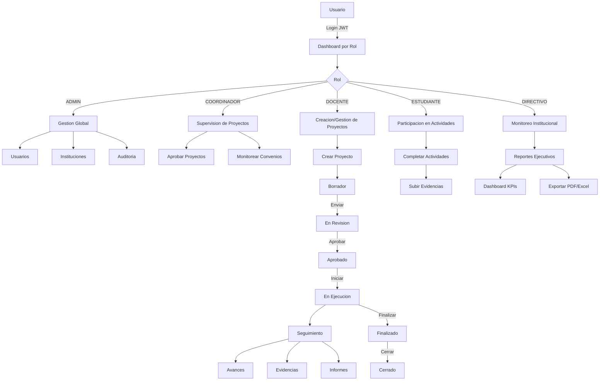

<div align="center">


# Sistema de Gestion de Proyectos de Vinculacion con la Sociedad

### Universidad Nacional de Loja
**Area de la Energia, las Industrias y los Recursos Naturales No Renovables**


---

**Sistema web para la gestion integral del ciclo de vida de proyectos de vinculacion
universitaria, convenios interinstitucionales, seguimiento, auditoria y reportes.**

[Documentacion de la API](http://127.0.0.1:8000/api/docs/) | [Guia del Desarrollador](docs/guia-desarrollador/README.md) | [Contribuir](CONTRIBUTING.md)

</div>

---

## Tabla de Contenidos

- [Descripcion del Sistema](#descripcion-del-sistema)
- [Tecnologias](#tecnologias)
- [Arquitectura General](#arquitectura-general)
- [Modulos del Sistema](#modulos-del-sistema)
- [Funcionalidades](#funcionalidades)
- [Flujo del Sistema](#flujo-del-sistema)
- [Roles de Usuario](#roles-de-usuario)
- [Instalacion](#instalacion)
- [Variables de Entorno](#variables-de-entorno)
- [Documentacion de la API](#documentacion-de-la-api)
- [Estructura del Proyecto](#estructura-del-proyecto)
- [Buenas Practicas](#buenas-practicas)
- [Guia para Desarrolladores](#guia-para-desarrolladores)
- [Flujo de Trabajo Git](#flujo-de-trabajo-git)
- [Equipo de Desarrollo](#equipo-de-desarrollo)
- [Licencia](#licencia)

---

## Descripcion del Sistema

El **Sistema de Gestion de Proyectos de Vinculacion con la Sociedad** es una plataforma
web institucional disenada para la **Universidad Nacional de Loja** que permite gestionar
el ciclo de vida completo de proyectos de vinculacion universitaria.

El sistema cubre desde la **formulacion y aprobacion** de proyectos, pasando por el
**seguimiento y avance**, hasta la generacion de **reportes ejecutivos** con graficas
interactivas y exportacion a PDF/Excel. Ademas, gestiona **convenios interinstitucionales**,
**auditoria** de todas las acciones del sistema y **formatos institucionales** descargables.

> **Nota sobre configuracion**: El repositorio incluye un archivo `.env.example`
> como plantilla de variables de entorno. Copialo a `.env` y configura tus
> propios valores. Nunca subas el archivo `.env` con secretos reales.

---

## Tecnologias

### Backend

| Tecnologia | Version | Proposito |
|:-----------|:--------|:----------|
| Python | 3.12 | Lenguaje de programacion |
| Django | 6.x | Framework web |
| Django REST Framework | 3.17 | API REST |
| SimpleJWT | 5.5 | Autenticacion JWT |
| django-cors-headers | 4.3 | Gestion de CORS |
| django-filter | 24.1 | Filtrado de queryset |
| drf-spectacular | 0.28 | Documentacion OpenAPI/Swagger |
| Pillow | 10.0 | Manejo de imagenes |
| django-environ | 0.11 | Variables de entorno |

### Frontend

| Tecnologia | Version | Proposito |
|:-----------|:--------|:----------|
| React | 19 | Framework de UI |
| TypeScript | 5.x | Tipado estatico |
| Vite | 6.x | Build tool / Dev server |
| Tailwind CSS | 3.x | Estilos utilitarios |
| Zustand | 5.x | Estado global |
| Axios | 1.x | Cliente HTTP |
| React Router | 7.x | Enrutamiento SPA |
| React Hook Form | 7.x | Formularios |
| ApexCharts | - | Graficas interactivas |
| Lucide React | - | Iconografia |

### Herramientas de Desarrollo

| Herramienta | Proposito |
|:------------|:----------|
| Git | Control de versiones |
| GitHub | Repositorio y colaboracion |
| Swagger / ReDoc | Documentacion de API |
| ESLint + Prettier | Linting y formateo |

---

## Arquitectura General

```
+---------------------------------------------------------------+
|                    PRESENTATION LAYER                         |
|  +----------------------------------------------------------+ |
|  |              React SPA (TypeScript)                       | |
|  |  +---------+ +----------+ +----------+ +---------+       | |
|  |  | Landing | |Dashboard | |Proyectos | |Convenios|       | |
|  |  +---------+ +----------+ +----------+ +---------+       | |
|  |  +----------+ +----------+ +----------+ +--------+       | |
|  |  |Seguimiento| | Reportes | |Auditoria | |Usuarios|       | |
|  |  +----------+ +----------+ +----------+ +--------+       | |
|  +----------------------------------------------------------+ |
|                           | HTTP/REST (JWT)                   |
+---------------------------+-----------------------------------+
|                    APPLICATION LAYER                          |
|  +----------------------------------------------------------+ |
|  |           Django REST Framework (API v1)                  | |
|  |  +---------+ +----------+ +----------+ +---------+       | |
|  |  |usuarios | | proyectos| | convenios| |seguimiento|     | |
|  |  +---------+ +----------+ +----------+ +---------+       | |
|  |  +----------+ +----------+ +----------+                  | |
|  |  | reportes | |auditoria | | formatos |                  | |
|  |  +----------+ +----------+ +----------+                  | |
|  +----------------------------------------------------------+ |
+---------------------------------------------------------------+
|                     DATA LAYER                                |
|  +----------------------------------------------------------+ |
|  |              SQLite (dev) / PostgreSQL (prod)             | |
|  +----------------------------------------------------------+ |
+---------------------------------------------------------------+
```

---

## Modulos del Sistema

### 1. `core` - Base Compartida

Modelos abstractos, permisos RBAC y utilidades compartidas entre todos los modulos.

### 2. `usuarios` - Autenticacion y Gestion de Usuarios

Registro, login, JWT, roles (ADMIN, COORDINADOR, DOCENTE, ESTUDIANTE, DIRECTIVO), gestion de carreras.

### 3. `proyectos` - Gestion de Proyectos (Modulo Principal)

Ciclo de vida completo: BORRADOR -> EN_REVISION -> APROBADO -> EN_EJECUCION -> FINALIZADO -> CERRADO.
Incluye: objetivos, indicadores, actividades, participantes, presupuestos, beneficiarios, alineaciones, firmas, marco logico, anexos.

### 4. `convenios` - Convenios Interinstitucionales

CRUD de convenios con estados: BORRADOR -> EN_REVISION -> VIGENTE -> VENCIDO/SUSPENDIDO/FINALIZADO/CANCELADO.
Gestion de instituciones, compromisos, productos y contribuciones.

### 5. `seguimiento` - Avances, Evidencias e Informes

Registro de avances por actividad, carga de evidencias, generacion de informes (inicial, parcial, final, tecnico, financiero), alertas automaticas, revisiones y flujos de validacion.

### 6. `reportes` - Dashboards y Reportes

Estadisticas generales, dashboards por rol, reportes de proyectos/convenios/progreso/docente, exportacion a PDF y Excel.

### 7. `auditoria` - Trazabilidad

Registro automatico de todas las acciones del sistema (CREAR, ACTUALIZAR, ELIMINAR, APROBAR, RECHAZAR, INICIAR_SESION) con middleware y signals.

### 8. `formatos` - Formatos Institucionales

Gestion de formatos oficiales de la UNL (guias, formulacion, avance, finales) para pregrado y posgrado.

---

## Funcionalidades

- Gestion completa del ciclo de vida de proyectos (8 estados)
- Formulacion con metodologia de marco logico (6 pasos)
- Flujo de revision y aprobacion con notificaciones automaticas
- Registro de avances, evidencias e informes de seguimiento
- Gestion de convenios interinstitucionales
- Control de participantes (docentes y estudiantes)
- Reportes con graficas interactivas y exportacion PDF/Excel
- Auditoria completa de acciones del sistema
- Centro de notificaciones y alertas automaticas
- Formatos oficiales UNL descargables
- Autenticacion JWT con refresh automatico
- Control de acceso basado en roles (RBAC)
- Dashboards personalizados por rol
- Diseno responsivo para multiples dispositivos

---

## Flujo del Sistema



---

## Roles de Usuario

| Rol | Nivel | Permisos Principales |
|:----|:------|:---------------------|
| **ADMIN** | 5 | Acceso total: gestion de usuarios, instituciones, auditoria, configuracion del sistema |
| **COORDINADOR** | 4 | Aprobar proyectos, supervisar seguimiento, gestionar convenios, ver reportes |
| **DOCENTE** | 3 | Crear y gestionar proyectos, registrar avances, subir evidencias, ver reportes propios |
| **DIRECTIVO** | 2 | Monitorear proyectos, ver dashboards ejecutivos, supervisar convenios |
| **ESTUDIANTE** | 1 | Completar actividades asignadas, subir evidencias, ver su progreso |

---

---

## Instalacion

### Requisitos Previos

| Requisito | Version Minima | Verificar |
|:----------|:---------------|:----------|
| Python | 3.10+ | `python --version` |
| Node.js | 18+ | `node --version` |
| npm | 9+ | `npm --version` |
| Git | 2.x | `git --version` |

### 1. Clonar el Repositorio

```bash
git clone https://github.com/Cristhval/Proyectos-Vinculaci-n.git
cd Proyectos-Vinculaci-n
```

### 2. Configurar el Backend

```bash
# Crear entorno virtual
python -m venv venv

# Activar entorno virtual
# Windows:
venv\Scripts\activate
# macOS/Linux:
source venv/bin/activate

# Instalar dependencias
pip install -r requirements.txt
```

### 3. Configurar Variables de Entorno

```bash
# Copiar el archivo de ejemplo
cp .env.example .env
```

El archivo `.env` incluye valores por defecto para desarrollo local.
Ver seccion [Variables de Entorno](#variables-de-entorno) para mas detalles.

### 4. Aplicar Migraciones

```bash
python manage.py migrate
```

### 5. (Opcional) Poblar Datos de Prueba

```bash
# Crear superusuario administrador
python manage.py createsuperuser

# Poblar proyectos de ejemplo
python manage.py seed_proyectos_demo
```

### 6. Iniciar el Backend

```bash
python manage.py runserver
```

Disponible en: `http://127.0.0.1:8000`
Swagger: `http://127.0.0.1:8000/api/docs/`

### 7. Configurar el Frontend

```bash
# En una nueva terminal
cd frontend
npm install
cp .env.example .env
```

### 8. Iniciar el Frontend

```bash
npm run dev
```

Disponible en: `http://localhost:5173`

### Instalacion con Docker (Alternativa)

Si prefieres usar Docker, solo necesitas un comando:

```bash
docker-compose up --build
```

Esto levanta tres servicios automaticamente:

| Servicio | Puerto | Descripcion |
|:---------|:-------|:------------|
| `backend` | `8000` | Django + API REST (Gunicorn) |
| `frontend` | `80` | React SPA servido con Nginx |
| `db` | `5432` | PostgreSQL 16 |

Para poblar datos de prueba en Docker:

```bash
docker-compose exec backend python manage.py createsuperuser
docker-compose exec backend python manage.py seed_proyectos_demo
```

Accede en: `http://localhost`

---

## Variables de Entorno

### Backend (`.env`)

| Variable | Descripcion | Valor por Defecto |
|:---------|:------------|:-------------------|
| `DEBUG` | Modo de depuracion | `True` |
| `SECRET_KEY` | Clave secreta de Django | *(valor por defecto inseguro, cambiar en produccion)* |
| `ALLOWED_HOSTS` | Hosts permitidos | `localhost,127.0.0.1` |
| `DB_ENGINE` | Motor de base de datos | `django.db.backends.sqlite3` |
| `DB_NAME` | Nombre de la BD | `db.sqlite3` |
| `CORS_ALLOWED_ORIGINS` | Origenes permitidos CORS | `http://localhost:3000,http://localhost:5173` |

### Frontend (`frontend/.env`)

| Variable | Descripcion | Valor por Defecto |
|:---------|:------------|:-------------------|
| `VITE_API_URL` | URL base de la API | `http://127.0.0.1:8000/api/v1` |

---

## Documentacion de la API

La documentacion interactiva esta disponible en:

- **Swagger UI**: `http://127.0.0.1:8000/api/docs/`
- **ReDoc**: `http://127.0.0.1:8000/api/redoc/`

### Principales Endpoints

| Metodo | Endpoint | Descripcion |
|:-------|:---------|:------------|
| POST | `/api/v1/auth/login/` | Iniciar sesion |
| POST | `/api/v1/auth/register/` | Registrar usuario |
| POST | `/api/v1/auth/refresh/` | Renovar access token |
| GET/POST | `/api/v1/proyectos/` | Listar/Crear proyectos |
| GET/POST | `/api/v1/convenios/` | Listar/Crear convenios |
| GET/POST | `/api/v1/avances/` | Listar/Registrar avances |
| GET | `/api/v1/reportes/dashboard/` | Dashboard ejecutivo |
| GET | `/api/v1/auditoria/registros/` | Logs de auditoria |

*[Ver documentacion completa en Swagger](http://127.0.0.1:8000/api/docs/)*

---

## Estructura del Proyecto

```
Proyectos-Vinculaci-n/
|
+-- core/                          # Base compartida (modelos, permisos, utils)
+-- usuarios/                      # Autenticacion y gestion de usuarios
+-- proyectos/                     # Gestion de proyectos (modulo principal)
+-- convenios/                     # Convenios interinstitucionales
+-- seguimiento/                   # Avances, evidencias e informes
+-- reportes/                      # Dashboards y reportes
+-- auditoria/                     # Trazabilidad y auditoria
+-- formatos/                      # Formatos institucionales UNL
|
+-- proyecto_vinculacion_universidad/  # Configuracion Django (settings, urls)
|
+-- frontend/                      # Aplicacion React (SPA)
|   +-- src/
|   |   +-- api/                   # Servicios HTTP (1 por modulo backend)
|   |   +-- components/ui/         # Componentes reutilizables (20+)
|   |   +-- features/              # Paginas por dominio (11 modulos)
|   |   +-- hooks/                 # Custom hooks (useAuth, usePermissions)
|   |   +-- layouts/               # Layouts (Auth, Dashboard, Sidebar)
|   |   +-- lib/                   # Utilidades (formatters, exportadores)
|   |   +-- routes/                # Enrutamiento y navegacion
|   |   +-- store/                 # Estado global (Zustand)
|   |   +-- types/                 # Interfaces TypeScript por modulo
|   +-- public/                    # Assets estaticos
|
+-- media/                         # Archivos subidos por usuarios
+-- docs/                          # Documentacion tecnica
|
+-- manage.py                      # CLI de Django
+-- requirements.txt               # Dependencias Python
+-- .env.example                   # Plantilla de variables de entorno
+-- .gitignore                     # Archivos excluidos del versionado
+-- README.md                      # Este archivo
+-- CONTRIBUTING.md                # Guia de contribucion
+-- CHANGELOG.md                   # Historial de versiones
+-- CODE_OF_CONDUCT.md             # Codigo de conducta
+-- SECURITY.md                    # Politica de seguridad
+-- LICENSE                        # Licencia del proyecto
```

---

## Buenas Practicas Implementadas

| Practica | Estado | Detalle |
|:---------|:------:|:--------|
| Arquitectura modular por dominio | Si | 8 apps Django, cada una con responsabilidad unica |
| API RESTful con endpoints estandarizados | Si | `/api/v1/[recurso]/` con CRUD completo |
| Autenticacion JWT | Si | Access + Refresh tokens con rotacion y blacklist |
| RBAC (Role-Based Access Control) | Si | 5 roles jerarquicos con permisos granulares |
| Auditoria automatica | Si | Middleware + signals registran todas las acciones |
| Componentes UI reutilizables | Si | 20+ componentes en `frontend/src/components/ui/` |
| Tipado estatico TypeScript | Si | Interfaces por modulo, modo estricto |
| Documentacion de API (OpenAPI) | Si | Swagger + ReDoc via drf-spectacular |
| Variables de entorno | Si | django-environ + .env.example |
| Git Flow | Si | Branches: main, develop, feature/* |

---

## Guia para Desarrolladores

### Agregar una Nueva App Django

```bash
# 1. Crear la app
python manage.py startapp mi_app

# 2. Registrar en settings.py -> INSTALLED_APPS
# 3. Crear modelos, serializers, views, urls
# 4. Incluir URLs en proyecto_vinculacion_universidad/urls.py
# 5. Crear migraciones
python manage.py makemigrations
python manage.py migrate
```

### Agregar un Nuevo Componente React

```bash
# 1. Crear archivo en src/components/ui/ o src/features/[modulo]/
# 2. Exportar desde index.ts (si es UI component)
# 3. Tipar con TypeScript
# 4. Usar Tailwind CSS para estilos
```

### Comandos Utiles del Backend

```bash
python manage.py runserver              # Iniciar servidor
python manage.py migrate                # Aplicar migraciones
python manage.py makemigrations         # Crear migraciones
python manage.py createsuperuser        # Crear admin
python manage.py seed_proyectos_demo    # Poblar datos de prueba
python manage.py generar_alertas        # Generar alertas de vencimiento
python manage.py shell                  # Shell de Django
python manage.py test                   # Ejecutar tests
```

### Comandos Utiles del Frontend

```bash
npm run dev        # Servidor de desarrollo
npm run build      # Build de produccion
npm run lint       # Linting
```

---

## Flujo de Trabajo Git

Este proyecto utiliza **Git Flow** con las siguientes ramas:

| Rama | Proposito | Protegida |
|:-----|:----------|:---------:|
| `main` | Produccion, listo para evaluacion | Si |
| `develop` | Integracion de nuevas funcionalidades | Si |
| `feature/*` | Nuevas funcionalidades | No |
| `fix/*` | Correccion de bugs | No |

### Convencion de Commits (Conventional Commits)

A partir de la **v1.0.0**, todos los commits deben seguir el formato:

```
<tipo>(<alcance>): <descripcion corta>

[opcional: cuerpo del commit]

[opcional: footer con referencias a issues]
```

### Tipos de Commit

| Tipo | Descripcion | Ejemplo |
|:-----|:------------|:--------|
| `feat` | Nueva funcionalidad | `feat(proyectos): agregar filtro por estado` |
| `fix` | Correccion de bug | `fix(auth): corregir refresh token expirado` |
| `refactor` | Reestructuracion sin cambio funcional | `refactor(convenios): extraer logica a services.py` |
| `docs` | Documentacion | `docs: actualizar README con instalacion` |
| `style` | Cambios de estilo/UI | `style(dashboard): actualizar colores de badges` |
| `test` | Tests | `test(proyectos): agregar tests de validacion` |
| `perf` | Mejora de rendimiento | `perf(reportes): optimizar consultas N+1` |
| `build` | Configuracion de build | `build: actualizar dependencias de pip` |
| `ci` | Integracion continua | `ci: agregar GitHub Actions para tests` |
| `chore` | Tareas de mantenimiento | `chore: eliminar archivos innecesarios` |

### Flujo de Trabajo

```
1. Crear rama desde develop:
   git checkout develop
   git pull
   git checkout -b feature/nombre-funcionalidad

2. Desarrollar y commitear:
   git add .
   git commit -m "feat(modulo): descripcion"

3. Push y Pull Request:
   git push origin feature/nombre-funcionalidad
   # Crear PR hacia develop

4. Merge despues de revision:
   git checkout develop
   git merge feature/nombre-funcionalidad

5. Release a main:
   git checkout main
   git merge develop
   git tag -a v1.0.0 -m "Release v1.0.0"
```

---

## Equipo de Desarrollo

- Alexander Sanchez
- Cristian Valverde
- Mateo Rojas
- David Toledo
- Jorge Luzuriaga
- Jean Encalada

**Carrera**: Ingenieria en Sistemas Computacionales
**Universidad**: Universidad Nacional de Loja
**Ano**: 2026

---

## Licencia

```
Copyright (c) 2026 Universidad Nacional de Loja
Todos los derechos reservados.

Este software es propiedad exclusiva de la Universidad Nacional de Loja
y fue desarrollado como proyecto academico para la carrera de
Ingenieria en Sistemas Computacionales.

Queda prohibida la reproduccion, distribucion, publica o privada,
de este software o cualquier parte del mismo, sin autorizacion
expresa por escrito de la Universidad Nacional de Loja.
```

---

<div align="center">

**Desarrollado para la Universidad Nacional de Loja**


</div>
