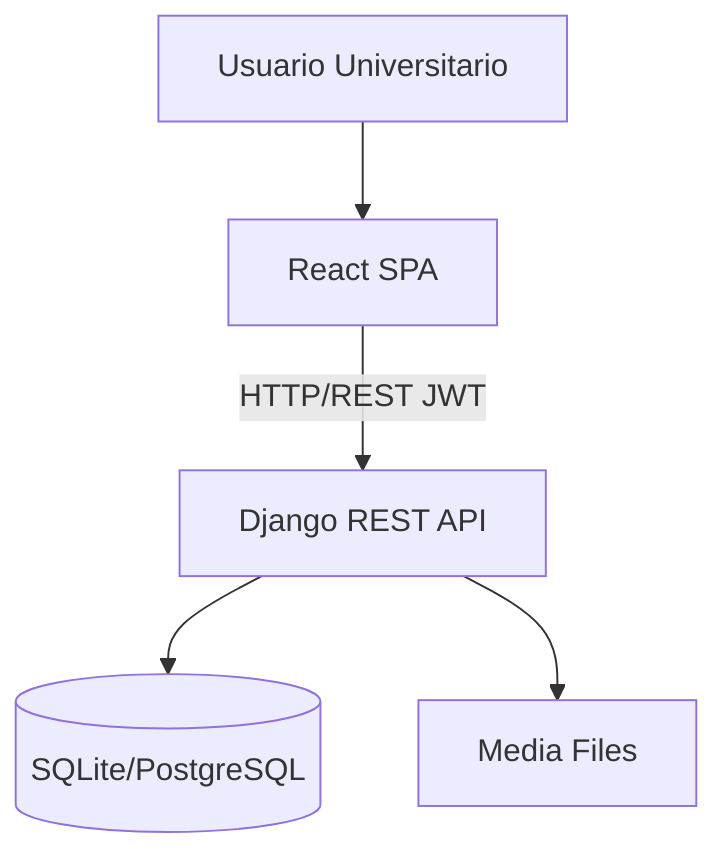
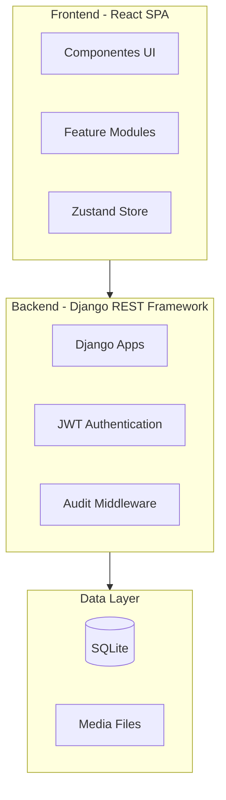
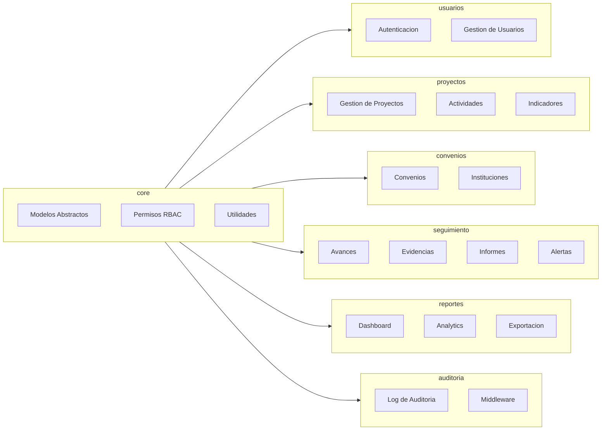
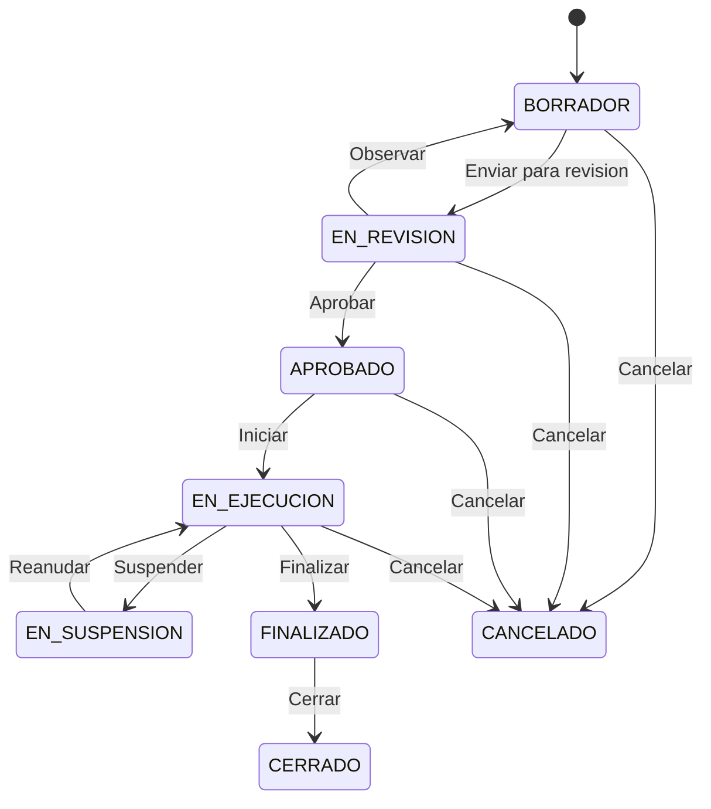
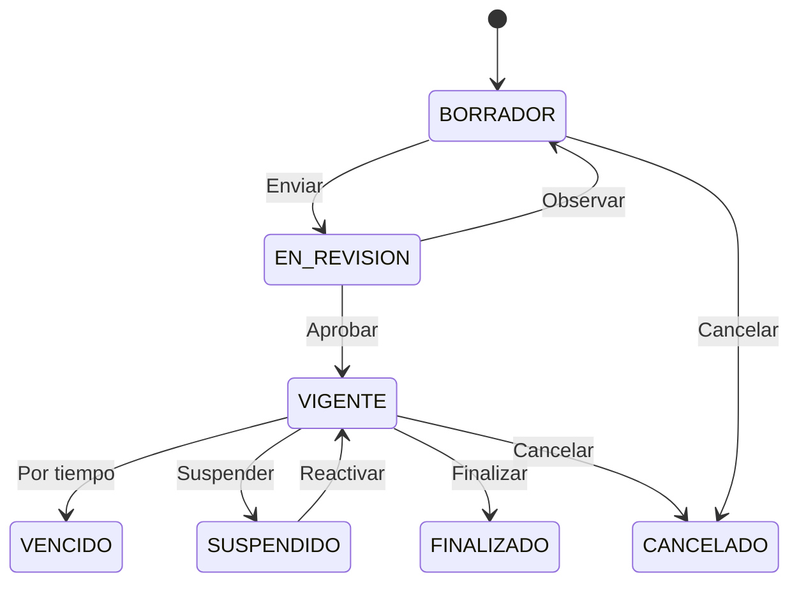

# Arquitectura del Sistema

## Vision General

El sistema sigue una arquitectura **monolitica modular** basada en Django,
con una API REST que consume una SPA (Single Page Application) en React.

## Diagrama C4 - Nivel 1 (Contexto)

## Diagrama C4 - Nivel 2 (Contenedores)

## Diagrama de Modulos Backend

## Patron de Flujo de Proyectos

## Patron de Flujo de Convenios

## Patrones de Diseno Aplicados

- **Repository Pattern**: Modelos Django como capa de acceso a datos
- **Service Layer**: Logica de negocio en `services.py` de cada app
- **Serializer Pattern**: DRF Serializers para validacion y transformacion
- **RBAC**: Control de acceso basado en roles jerarquicos
- **Middleware Pattern**: Auditoria automatica via middleware
- **Signal Pattern**: Eventos Django para logging automatico
